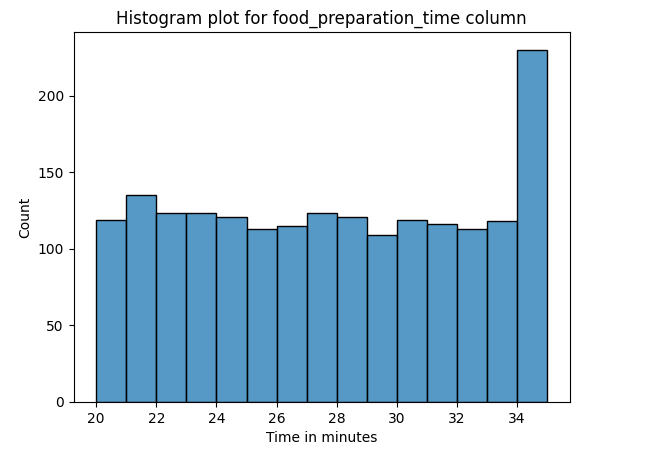
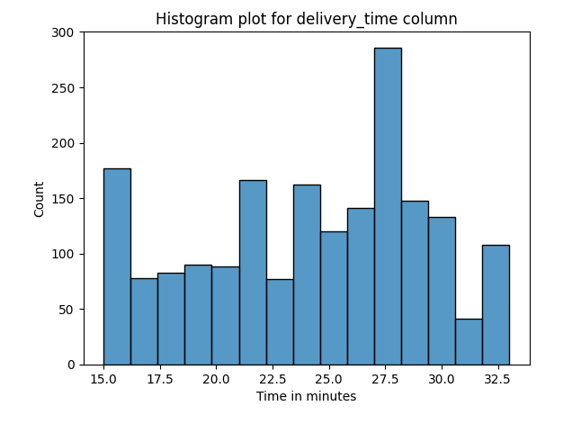
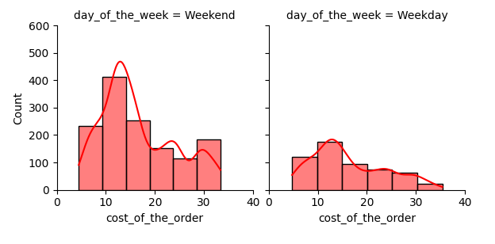
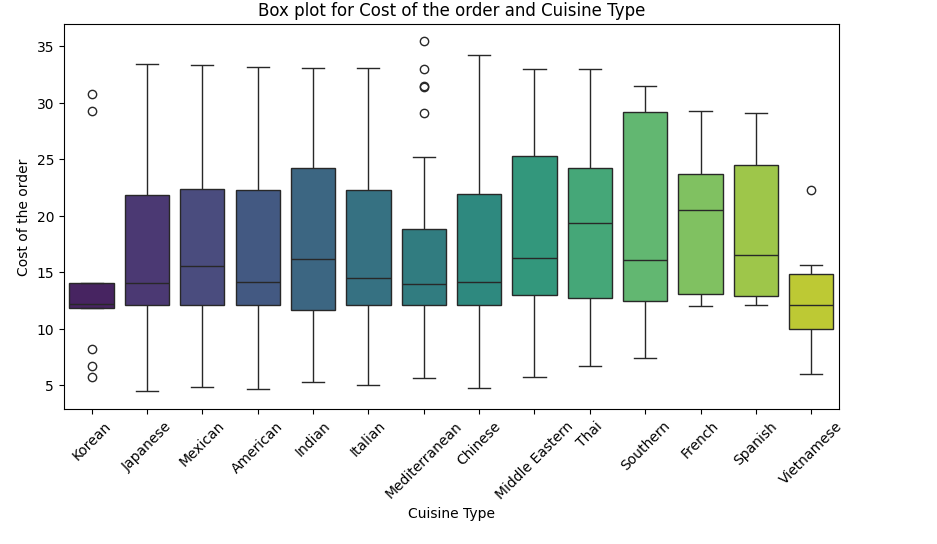
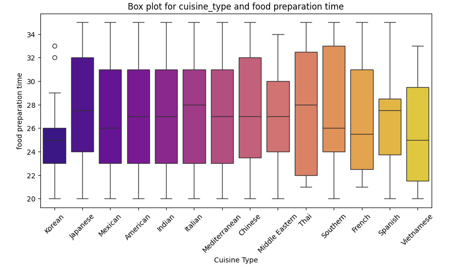
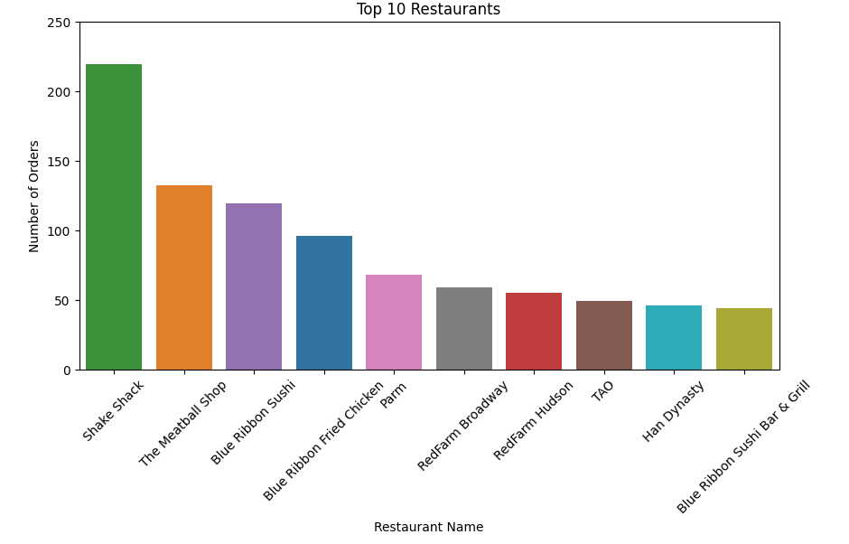

# 🍽️ FoodHub EDA Analysis

An exploratory data analysis (EDA) project on the **FoodHub** dataset to uncover meaningful insights about customer behavior, order patterns, delivery times, and cuisine preferences. This project helps a food aggregator platform enhance customer experience through data-backed decisions.

---

## 📌 Objectives

- Understand the distribution of customer ratings, order costs, and delivery times.
- Identify high-performing cuisines and delivery partners.
- Analyze delivery trends across cities.
- Provide business recommendations based on customer behavior.

---

## 🛠️ Tools & Technologies

- **Language**: Python
- **Libraries**: Pandas, NumPy, Matplotlib, Seaborn
- **Techniques**:
  - Univariate & Bivariate Analysis
  - Data Cleaning & Preprocessing
  - Visualization of Customer Patterns
  - Business Recommendations

---

## 📈 Key Insights

- **Food Preparation and Delivery Times:**
  - On average, food takes about 27 minutes to prepare and 24 minutes to deliver.
  - Delivery takes longer on weekdays compared to weekends, likely because there are fewer delivery people or more traffic.

- **Cost of Orders and Customer Behavior:**
  - About 29% of the orders cost more than 20$.
  - And 70.76% of order costs less then 20$, indicating majority of the customers are interested in buying low cost food.
  - On weekends, American cuisine is the most popular, suggesting customers choose comfort food.

- **Customer Ratings and Order Costs:**
  - There is no strong link between the cost of an order and its rating, meaning price does not mainly drive customer satisfaction.
  - Majority of the restaurants consistently receive higher ratings and no restaurant has got rating below 3 which implies strong positive customer feedback.

- **Revenue Generation:**
  - Total Order Value ($31,314.82): This is the gross amount of all orders.
  - FoodHub Revenue ($6,166.30): This is the net earnings from orders after taking their commission (revenue calculated as per question 14).
  - FoodHub earns roughly 19.7% of the total order value as revenue.

**Popular Cuisines and Restaurants:**

- **Top 3 Cuisines: Based on order frequency, the top 3 cuisines are:**
  - American
  - Japanese
  - Italian

- **Top 3 Restaurants: The analysis identified the top 3 restaurants:**
  - Shake Shack
  - The Meatball Shop
  - Blue Ribbon Shushi

- **Weekend Popularity:**
  - American cuisine is especially popular on weekends, suggesting a strong customer preference for that cuisine.

- **Weekend vs. Weekday Orders:**
  - Total Orders: The dataset contains 1,898 orders.
  - Approximately 547 orders were placed on weekdays, and 1351 orders were placed on weekends.

---

## 🧪 Sample Visualizations

### 📦 Food Preparation Time

---

### 🚚 Delivery Time Distribution

---

### 💰 Cost Distribution – Weekend vs Weekday

---

### 🍽️ Cuisine Type vs Cost of Order

---

### 🍱 Food Preparation Time by Cuisine

---

### 🏆 Top 10 Restaurants by Orders

---

## 🔚 Conclusion

This project demonstrates how basic exploratory techniques can reveal deep customer insights in the food delivery business. These findings can help stakeholders optimize menus, delivery routes, and marketing strategies.

---
